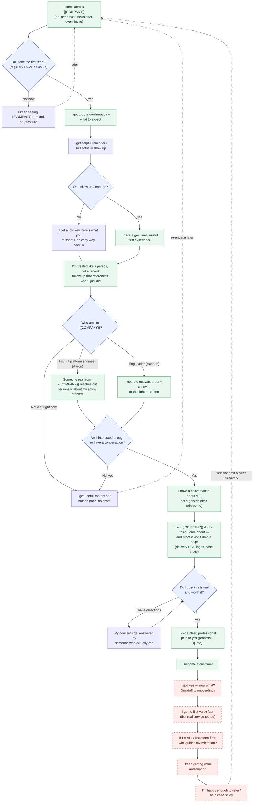
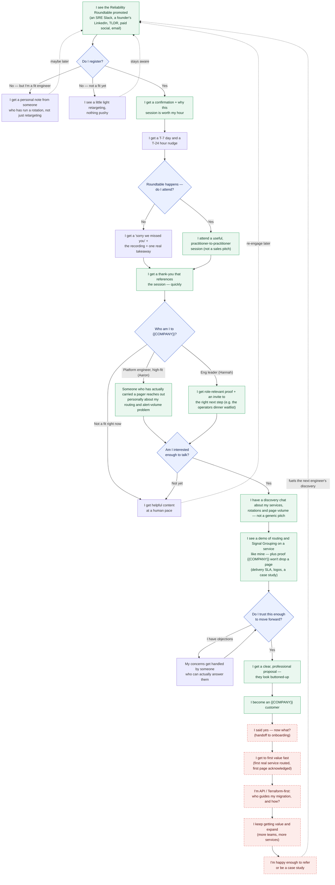

# {{COMPANY}} Buyer's Journey — Companion Doc

**Tactic in focus:** the Reliability Roundtable webinar (worked example of a reusable template)
**For:** the GTM working session · **Draft:** v2 · **Drivers:** Scott (RevOps) + {{HEAD_OF_MARKETING_FIRST}} (Marketing)
**Companion to:** `founder-webinar-buyer-journey.mmd` and `buyer-journey-template.mmd`

---

## TL;DR — how to use this

The two diagrams show the journey **in the buyer's own words** — what they see, receive, and decide. That is deliberate: it's the view {{SALES_LEAD_FIRST}} asked for. This doc holds everything the diagram intentionally leaves off — **who owns each step, the touchpoints and content behind it, and (critically) which steps are real but undefined today.**

Read the diagram first to feel the buyer's experience. Read this to run the work session.

---

## What this is — and isn't

- **It's one tactic, as a worked example.** The Reliability Roundtable is the instance; `buyer-journey-template.mmd` is the reusable skeleton it's built from. Every future tactic (operators dinner, newsletter, content offer, paid) reuses the same shape.
- **It is not the whole GTM.** Our **bowtie funnel** stays the "map of the world." A tactic journey *zooms in* on one entry point, then **merges back into the shared funnel** — it doesn't re-map everything.
- **We are not boiling the ocean.** One tactic can't carry the entire path to Closed Won. We map the experience in real detail **through the early sales motion**, then mark everything post-sale as **gaps to define** — because honestly, we don't know those steps yet.
- **The gaps are the point.** The undefined nodes (shown dashed/red) are the deliverable: each one becomes a piece of work with an owner. That's what turns this map into a budget-justifying plan.

---

## The reframe we're bringing into the room

So we don't spend the first 30 minutes re-litigating "why are we here," three framing choices are baked into these artifacts:

1. **Buyer's POV, not our mechanics.** The diagram reads as "I get invited… I attend… I get a personal follow-up." The internal machinery lives here, in the doc.
2. **Start from the end of the funnel.** The detail and the honesty concentrate where {{SALES_LEAD_FIRST}} has the least confidence: discovery → demo → proof → close → "now what?"
3. **Does / Could / Should.** For each phase we name what it *does* look like today, what it *could*, and what it *should*. Lowers the stakes (nothing here is final) and invites every team to fill their part.

---

## The two diagrams

> Pure buyer's-POV by design. Both render in Notion/GitHub (paste the fenced block), Figma (Mermaid→FigJam plugin), and Whimsical (paste into a Mermaid block — Whimsical ignores the colour styling, which is fine). The preview links open the rendered diagram instantly — handy while Whimsical editor access is being restored.

### 1) Reusable template

### 2) Reliability Roundtable — the worked example

---

## Stage-by-stage: the mechanics behind the buyer's experience

The Reliability Roundtable journey, decoded. **Status:** ✅ defined · 🟡 partly defined · ⚠️ gap (real but undefined today).

| # | Buyer moment (diagram) | Funnel stage | Owner → Assist | Touchpoints, content & timing | Status |
|---|------------------------|--------------|----------------|-------------------------------|--------|
| 1 | I see the roundtable promoted | Pre-MEL (Targeted/Aware) | Marketing ({{HEAD_OF_MARKETING_FIRST}}/Scott) | {{CEO_FIRST}}'s LinkedIn, TLDR newsletter, SRE community Slacks, paid social, email, organic; T-30→T-7 | ✅ |
| 2 | I register | MEL (Marketing Engaged) | Marketing | Landing page + confirmation w/ session details and the panel line-up | ✅ |
| 3 | I get reminders | MEL | Marketing | T-7 day + T-24 hour reminder emails | ✅ |
| 4 | I attend | MEL | Marketing (+ {{CEO_FIRST}} host, {{AE_FIRST}} co-host) | Live session; practitioner-to-practitioner content, not a pitch | ✅ |
| 5 | I get a relevant thank-you | MEL→MQL | Marketing → Sales | Thank-you referencing the session; "sorry we missed you" + recording for no-shows; **fast** | 🟡 default exists; not yet customized per entry point |
| 6 | {{COMPANY}} treats me by who I am | MQL | Marketing → Sales | Split by persona/fit: platform engineer (Aaron) vs eng leader (Hannah) vs not-a-fit; scoring decides "ready for sales" | 🟡 logic exists; persona branches not built |
| 7 | A real person reaches out personally | SAL (Sales Accepted) | Sales — {{AE_FIRST}} (AE), {{CEO_FIRST}} (founder-led) | First-touch email referencing the roundtable topic; "{{CEO_FIRST}}-styled" personal cadence for VIPs and high-fit engineers | ⚠️ sequence, cadence & call script undefined (and not visible to RevOps — no `~~enrichment` sequencer access) |
| 8 | I have a discovery chat about *my* services | SQL (Meeting Scheduled) | Sales — {{AE_FIRST}}/{{CEO_FIRST}} | Discovery call + qualification script; agenda tailored to routing, page volume, and rotation shape — not a generic tour | ⚠️ discovery script & qualification criteria undefined |
| 9 | I see a tailored demo + proof you won't drop a page | Opportunity | Sales → Product Marketing ({{CONTENT_LEAD_FIRST}}) / Design ({{DESIGN_LEAD_FIRST}}) | Demo of routing + Signal Grouping on a service like theirs; **trust slide**: notification delivery SLA, logos, a case study | ⚠️ new-positioning deck, demo path & proof assets undefined |
| 10 | My objections get handled | Opportunity | Sales → Sales Eng/Product ({{SALES_ENG_FIRST}}/{{PRODUCT_LEAD_FIRST}}) | Objection handling; SE/product brought in to de-risk (e.g., migration effort, "will it page during the cutover?") | ⚠️ no SE motion / who-owns-objections undefined |
| 11 | I get a clear, professional proposal → I'm a customer | Closed Won | Sales — {{CEO_FIRST}}/{{AE_FIRST}} | Proposal/quote that looks buttoned-up (the {{LOST_DEAL_EXAMPLE}} lesson) | ⚠️ quoting experience & proposal template undefined |
| 12 | I said yes — now what? | Onboarding / CS | Sales → CS ({{CS_LEAD_FIRST}}) / Product ({{PRODUCT_LEAD_FIRST}}) | Handoff to onboarding; first routed service; **API/Terraform-first buyers have no guided migration path**; expansion → referral/case study | ⚠️ entire post-sale experience undefined (the "event horizon") |

---

## Funnel stage definitions (with the label fixes)

Aligned to `docs/gtm-scorecard-definitions.md` (v1.3). These correct the old labels still on the original Whimsical diagram.

| Stage | What it means (human) | Entry criteria | Exit criteria |
|-------|----------------------|----------------|----------------|
| **MEL** — Marketing Engaged | Took a real action with {{COMPANY}} | First enters "Marketing Engaged" lifecycle (registers, attends, downloads, starts a free workspace) | Becomes MQL, or decays to nurture |
| **MQL** — Marketing Qualified | Sales-ready: hand-raiser, score threshold, or outbound-sourced | `mql_type` = Handraiser P1 / Score Threshold P2 / Outbound | Sales accepts (→ SAL) or recycles |
| **SAL** — Sales Accepted *(was "meeting booked")* | Sales **accepts and actively pursues** the lead | Sales accepts the MQL and starts a cadence | Prospect schedules a meeting (→ SQL) or is recycled |
| **SQL** — Meeting Scheduled *(this is now "meeting booked")* | Prospect **responds and books a meeting** | Meeting scheduled after pursuit | Discovery completed → Opportunity, or no-show/disqualify |
| *(Meeting held)* | Discovery actually completed | — | **No longer its own stage** — it's an *outcome* of the sales effort, tracked as a metric only |
| **Opportunity** | Qualified deal in pipeline | Discovery done + qualified; deal created | Closed Won / Closed Lost |
| **Closed Won** | Signed customer | Contract signed | → Onboarding |
| **Onboarding / CS** | Post-sale value + expansion | Handed off from Sales | ⚠️ undefined today |

---

## Does / Could / Should — the meeting frame

Honest current-state on the left; this is where the room fills the rest in.

| Phase | Does today | Could | Should |
|-------|-----------|-------|--------|
| **Pre-event → attend** | Solid: invite, register, remind, attend | Tighten persona targeting on promo | Keep; this part works |
| **Post-event follow-up** | One generic flow — everyone gets the same "thanks for playing," then handed to {{AE_FIRST}} | Customize the first 1–2 touches by entry point (roundtable vs dinner) | Branch by persona/fit; reference the actual session; route VIPs to a personal cadence |
| **Sales motion (SAL→SQL)** | {{AE_FIRST}} runs ~3 emails / a few calls; specifics not visible to RevOps; pitch still on *old* positioning | Update {{AE_FIRST}}'s talk track to the ownership-as-code positioning | Defined cadence + discovery script per persona; RevOps visibility into the `~~enrichment` sequencer |
| **Demo + proof** | Inconsistent; lost {{LOST_DEAL_EXAMPLE}} on trust/polish vs {{COMPETITOR_A}} | Build a trust slide (delivery SLA, multi-region notification path, logos, case study) | A repeatable demo + new-positioning deck that survives a 300-engineer buying cycle |
| **Close** | Ad hoc | Proposal template | Quoting experience that looks as professional as {{COMPETITOR_B}}'s |
| **Post-sale (onboarding→expansion)** | Unknown — "{{AE_FIRST}} maybe calls them," then radio silence | Define the first-routed-service path; special-case Terraform-first buyers | A designed onboarding with owner, steps, timeline, and what the customer gets |

---

## The gaps = the work (the "leaves of the graph")

Each gap is a real buyer experience that's undefined today — and therefore a task with an owner. **This list is the budget-justifying output of the session.**

| Gap (buyer-facing) | Why it matters to the buyer | Likely owner | Open question to resolve tomorrow |
|--------------------|-----------------------------|--------------|-----------------------------------|
| Customized post-event follow-up | Generic "thanks for playing" erodes trust after a high-touch moment | Marketing ({{HEAD_OF_MARKETING_FIRST}}/Scott) | What are the first 1–2 touches per entry point, per persona? |
| {{AE_FIRST}}'s post-event sequence + call script | The buyer's first human contact sets the tone | Sales ({{CEO_FIRST}} defines, {{AE_FIRST}} runs) | What does {{AE_FIRST}} actually send/say? How many touches? |
| New-positioning sales deck + trust slide | Buyers at 300+ engineers expect polish + proof we won't drop a page | Product Marketing ({{CONTENT_LEAD_FIRST}}) + Design ({{DESIGN_LEAD_FIRST}}) | What's the deck, and what proof (delivery SLA, logos, case study)? |
| Demo path for routing + Signal Grouping | They need to *see* the thing they were sold, on a service like theirs | Sales + Product ({{PRODUCT_LEAD_FIRST}}) | What's the standard demo? What must the product show? |
| Objection-handling / SE motion | Unanswered doubts kill deals ({{LOST_DEAL_EXAMPLE}}) | Sales Eng ({{SALES_ENG_FIRST}}?) + Product ({{PRODUCT_LEAD_FIRST}}) | Who owns objections? Do we need an SE? |
| Quoting / proposal experience | A scrappy quote signals "amateurs" | Sales ({{CEO_FIRST}}) | What's the proposal template + quoting flow? |
| Sales→onboarding handoff | "I said yes — now what?" is the event horizon | Sales → CS ({{CS_LEAD_FIRST}}) | What's the handoff? What does the buyer get, and when? |
| Onboarding / first routed service | Positive impact decays if the first real page doesn't land correctly | CS ({{CS_LEAD_FIRST}}) + Product ({{PRODUCT_LEAD_FIRST}}) | What are the first-use steps that create a great first experience? |
| API / Terraform-first migration | These buyers get lost entirely today — they want to import an existing rotation, not rebuild it | Product ({{PRODUCT_LEAD_FIRST}}) | Who guides the migration? Steps, owner, timeline, deliverable? |
| Cross-system hygiene | Marketing & sales motions don't talk to each other; free-tier signups don't reach either | RevOps (Scott) | How do we connect nurture ↔ sales cadence ↔ product telemetry (HubSpot, the `~~enrichment` sequencer, workspace events)? |

---

## Open questions for the room

- **Ownership:** who owns customization *at each stage* — and who breaks ties across marketing/sales/product? (Proposed: Scott as the RevOps mediator who owns the map's existence.)
- **Default vs. persona:** do we agree on one default motion first, then fan out by persona (Aaron vs Hannah)?
- **Motion type:** are we a sales-led, PLG, or hybrid sales-assisted motion for these buyers? (Free-tier workspaces already accelerate readiness — and today nothing acts on them.)
- **Post-sale truth:** what *actually* happens after Closed Won today ({{CS_LEAD_FIRST}}), and what should? Do we need a sales engineer ({{SALES_ENG_FIRST}})?
- **Visibility:** RevOps needs read access to the `~~enrichment` sequencer to map the real sales sequence (currently a blind spot).

---

## Appendix — personas referenced

- **Aaron the Platform Engineer** — Staff platform/SRE engineer at a 50–500-engineer B2B SaaS company. Owns the paging stack; evaluates through the API and Terraform provider docs before booking a demo; hates page volume more than he hates any competitor. **Our high-value target and the roundtable's primary audience.**
- **Hannah the VP Engineering** — VP/Head of Engineering, Series B/C, 90–200 engineers. Business buyer with Platform, Security, and Finance stakeholders; cares about MTTR, SLA commitments, on-call fairness, and retention; expects proof, references, and polish. **The engineering-leadership (e.g. partner-newsletter) audience.**

*Sources: `context/personas/`, `docs/gtm-scorecard-definitions.md` (v1.3), and the three buyer-journey working sessions.*
