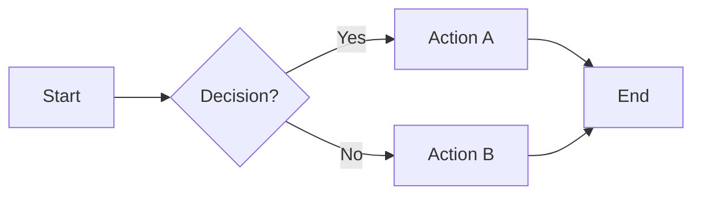

# Diagram Generator

Turn descriptions, processes, data models, and rough notes into clean, importable
Mermaid diagrams — with a live preview link so the user can see it rendered
immediately.

---

## Step 1: Identify the domain and diagram type

Understand what kind of thing is being diagrammed before writing a single line of code.
This shapes both the diagram type and how accurate the output will be.

**Domain cues → best diagram types:**

| Domain | Common use case | Best diagram type |
|--------|----------------|-------------------|
| SOP / process documentation | Step-by-step workflows, approvals | `flowchart` |
| Marketing / campaign workflows | Nurture sequences, funnel stages | `flowchart` (with swim lanes) |
| Technical / system architecture | API calls, service interactions | `sequenceDiagram` |
| Lead/ticket lifecycle | Status stages with transitions | `stateDiagram-v2` |
| Data models / schemas | Database tables, object relationships | `erDiagram` |
| Timelines / project plans | Sprints, milestones, schedules | `gantt` |

If the user hasn't specified a diagram type, make a recommendation and briefly explain
why. Example: "This looks like a lifecycle — I'll use a state diagram to show the
stages and transitions clearly. Let me know if you'd prefer a flowchart instead."

---

## CRITICAL: Check Whimsical compatibility before generating

**Not all Mermaid types render in Whimsical.** Whimsical only converts two types:
- ✅ `flowchart` — renders as editable shapes
- ✅ `sequenceDiagram` — renders as editable shapes
- ❌ `erDiagram`, `stateDiagram-v2`, `gantt`, `classDiagram`, etc. — paste as plain text

If the best diagram type for the user's request is NOT supported by Whimsical, tell
them BEFORE generating. Give them two options:

> "A state diagram is the most accurate way to visualize this, but it won't paste
> directly into Whimsical — it'll appear as plain text. I can either:
> (a) Generate the state diagram — works in Notion, GitHub, the Mermaid Live Editor,
>     and Figma plugins; or
> (b) Create a flowchart version instead, which IS pasteable into Whimsical
>     (though it's a bit less precise for lifecycle stages).
> Which would you prefer?"

Wait for their choice before generating. This saves them confusion when pasting fails.

**Figma** is fine for all types — use the Mermaid to FigJam plugin which handles
erDiagram, stateDiagram, etc. **Notion and GitHub** render all Mermaid types natively.

---

## Step 2: Ask for any missing context (briefly)

A rough diagram is better than none — don't interrogate the user. But if key
information is missing, ask one focused question:
- Actors or swim lanes: who does what? (people, systems, teams)
- Start and end points of the process
- Decision points or branching conditions
- Key entities and fields (for data models)

---

## Step 3: Generate the Mermaid diagram

Write clean, valid Mermaid syntax. Consult `references/mermaid-guide.md` for syntax
patterns and common gotchas for each diagram type.

**General rules:**
- Use descriptive node labels — not "Step 1" but "Review contract terms"
- Keep labels concise (under ~8 words) — long text wraps poorly
- Use `%%` for comments to explain non-obvious structure
- Quote labels containing special characters: `A["Has budget? (Y/N)"]`
- Avoid line breaks inside labels; use `<br/>` inside quotes if needed
- For flowcharts: use `LR` for wide processes, `TD` for deep decision trees

**Always wrap the diagram in a fenced code block:**

````

````

---

## Step 4: Generate a live preview link

After the diagram code block, ALWAYS run the `scripts/mermaid_link.py` script to
generate a clickable Mermaid Live Editor URL. This lets the user instantly see how
the diagram renders without needing to paste it anywhere first.

```bash
python3 /path/to/diagram-generator/scripts/mermaid_link.py "$(cat diagram.mmd)"
```

Or pipe the diagram code directly:

```bash
echo 'flowchart TD\n    A --> B' | python3 /path/to/diagram-generator/scripts/mermaid_link.py
```

The script prints a URL like:
`https://mermaid.live/edit#pako:...`

Present this to the user as:
> **[View diagram in browser](https://mermaid.live/edit#pako:...)** ← click to preview

The path to diagram-generator is the same directory as this SKILL.md file.

---

## Step 5: Save the .mmd file

Save the Mermaid code to a `.mmd` file in the workspace folder with a descriptive name.
Example: `email-approval-flowchart.mmd`

---

## Step 6: Deliver with context

Include these things with every diagram:

1. **A brief plain-English summary** (2-3 sentences) of what the diagram shows —
   helps the user verify it matches their mental model before they import it.

2. **The live preview link** (from Step 4) — most important. This is the "see what
   it looks like" moment.

3. **Import instructions** for the tools they mentioned. Standard set:

---

### How to use this diagram

**Whimsical** *(flowchart and sequenceDiagram only)*
New board → click the Mermaid icon → paste the diagram code (just the text between
the triple backticks). Whimsical auto-converts it to editable shapes.
*Note: erDiagram and stateDiagram types are not supported — see above.*

**Figma / FigJam**
Install the [Mermaid to FigJam](https://www.figma.com/community/plugin/1515624006157749329)
plugin → paste the Mermaid code → renders as editable FigJam shapes. Supports all
diagram types including erDiagram and stateDiagram.

**Notion / GitHub / Linear**
Paste the full fenced code block (including the \`\`\`mermaid markers) and it renders
inline. Supports all diagram types.

**LucidChart**
LucidChart doesn't import Mermaid natively. Best approach: use the Mermaid Live
Editor link → export as SVG → import the SVG into LucidChart.

---

## Step 7: Offer to iterate

After delivering, say something like:
"Want me to adjust the layout, add swim lanes, add more nodes, or try a different
diagram type?"

Common follow-up improvements:
- Adding swim lanes (`subgraph` blocks in flowcharts)
- Splitting a dense diagram into multiple focused diagrams
- Converting a flowchart to a sequence diagram or state diagram (or vice versa)
- Color-coding node groups with `classDef`
- Generating the Whimsical-compatible flowchart equivalent of a state or ER diagram

---

## Reference files

- `references/mermaid-guide.md` — Syntax patterns, node shapes, and gotchas for each
  diagram type. Read this when generating complex diagrams or when you're unsure
  about syntax.

- `scripts/mermaid_link.py` — Helper script that generates a Mermaid Live Editor URL
  from diagram code. Always run this after generating a diagram.
