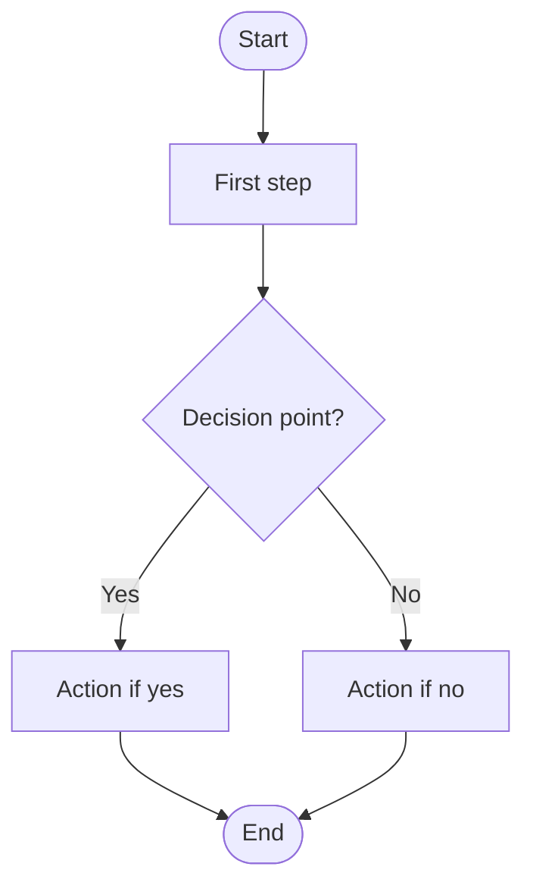
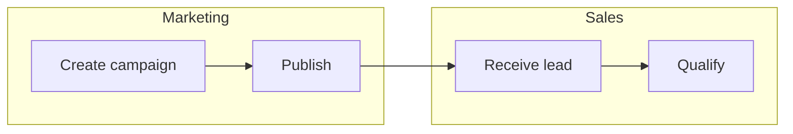
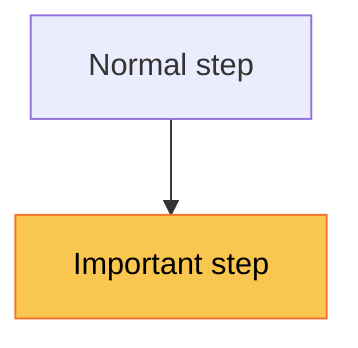
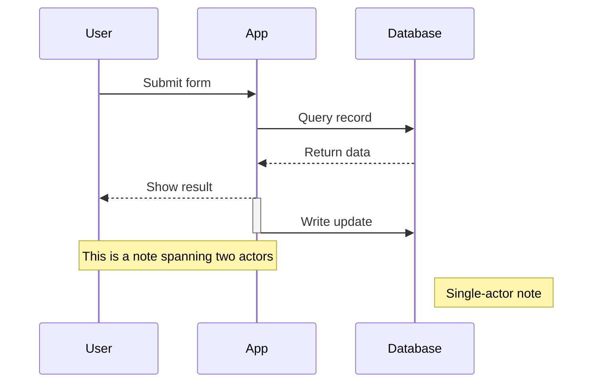
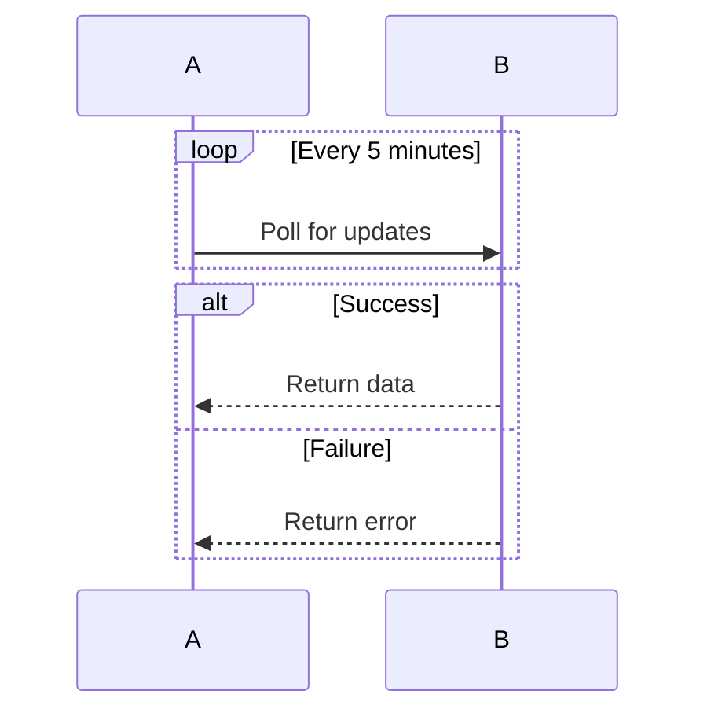
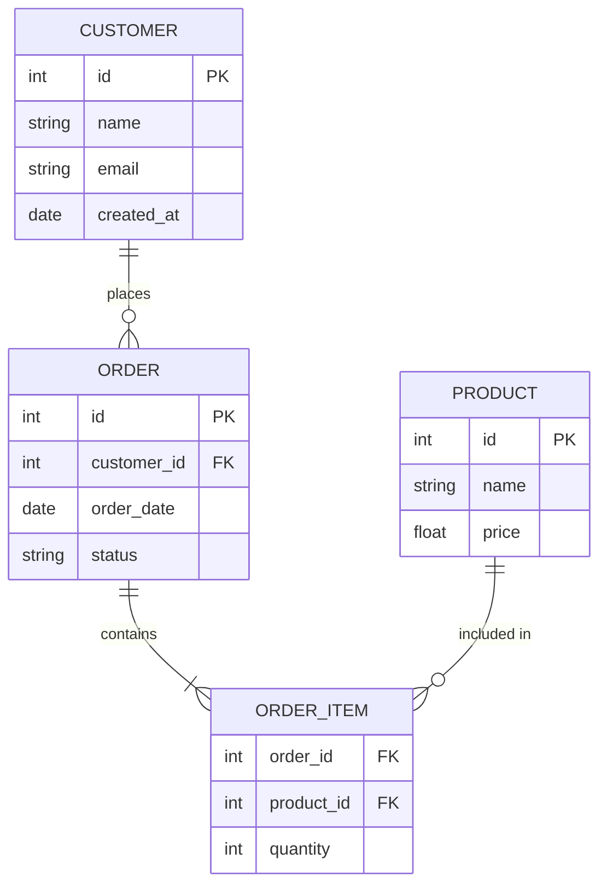
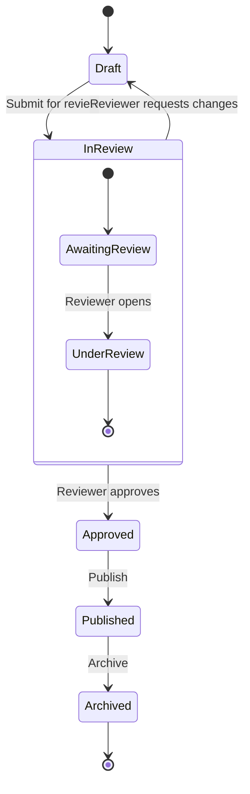
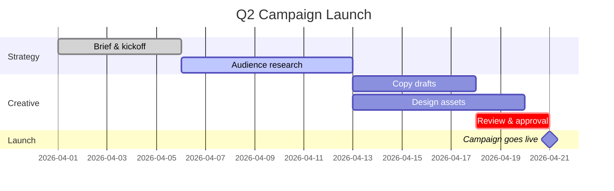
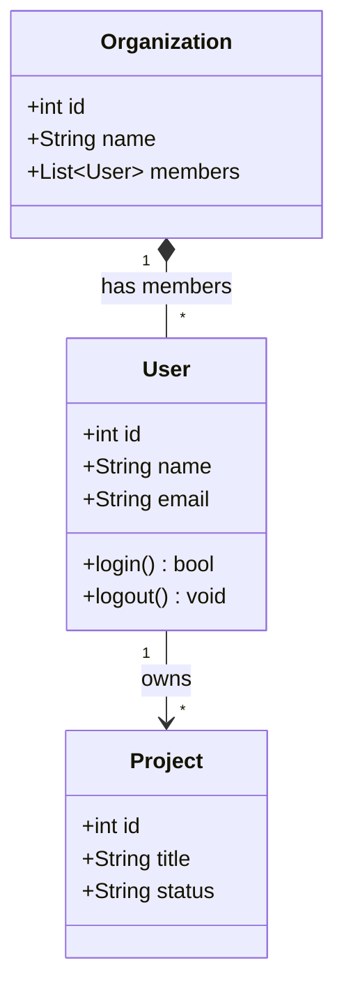

# Mermaid Syntax Reference

Quick-reference patterns for the most common diagram types. Always test mentally
that the syntax is valid before outputting — invalid Mermaid silently fails to render.

---

## Flowchart

Use for: process flows, SOPs, decision trees, campaign workflows.

**Node shapes:**
- `[Text]` — rectangle (process step)
- `{Text}` — diamond (decision)
- `([Text])` — stadium/pill (start/end)
- `[(Text)]` — cylinder (database)
- `((Text))` — circle (connector)
- `[/Text/]` — parallelogram (input/output)
- `[[Text]]` — subroutine

**Swim lanes** (use `subgraph` for lanes by team/system):

**Styling nodes** (use `classDef` for color groups):

**Gotchas:**
- Labels with parentheses, slashes, or quotes must be wrapped: `A["Label (detail)"]`
- Avoid `end` as a node ID — it's a reserved word
- `subgraph` titles with spaces need quotes: `subgraph "My Team"`

---

## Sequence Diagram

Use for: API calls, system interactions, auth flows, handoffs between services/teams.

**Arrow types:**
- `->>` solid arrow (sync call)
- `-->>` dashed arrow (async response)
- `-x` solid with X (failed call)
- `-)` open arrowhead

**Loops and conditionals:**

**Gotchas:**
- Participant aliases (`participant A as App`) prevent long names in arrows
- `autonumber` at the top adds step numbers automatically

---

## ER Diagram (Entity Relationship)

Use for: database schemas, data models, object relationships.

**Relationship cardinality:**
- `||--||` — exactly one to exactly one
- `||--o{` — one to zero or more
- `||--|{` — one to one or more
- `}o--o{` — zero or more to zero or more

**Gotchas:**
- Attribute types are display-only; Mermaid doesn't enforce them
- `PK` and `FK` are display markers, not functional
- Relationship labels must be quoted if they contain spaces

---

## State Diagram

Use for: status workflows, ticket lifecycles, approval chains.

**Gotchas:**
- Use `stateDiagram-v2` not `stateDiagram` (v2 is the current version)
- State names with spaces need quotes or underscores

---

## Gantt Chart

Use for: project timelines, sprint plans, campaign schedules.

**Status markers:** `done`, `active`, `crit` (critical path), `milestone`

---

## Class Diagram

Use for: object models, domain concepts, API response structures.

**Relationship types:**
- `-->` association
- `*--` composition
- `o--` aggregation
- `<|--` inheritance

---

## Common Gotchas (all diagram types)

1. **Special characters in labels** — Always quote labels containing `()`, `[]`, `/`, `#`, `&`, or `:`
2. **Reserved words** — Avoid using `end`, `start`, `class`, `state` as node IDs
3. **Long labels** — Keep under ~40 chars; break with ` ` inside quotes if needed
4. **Subgraph IDs** — Must be unique; using the same ID as a node causes silent failure
5. **Whitespace sensitivity** — Indentation matters in `sequenceDiagram` and `stateDiagram`
6. **Mermaid version differences** — Some tools use older Mermaid versions; stick to core syntax and avoid beta features like `kanban` or `sankey` unless you know the target renderer supports them
