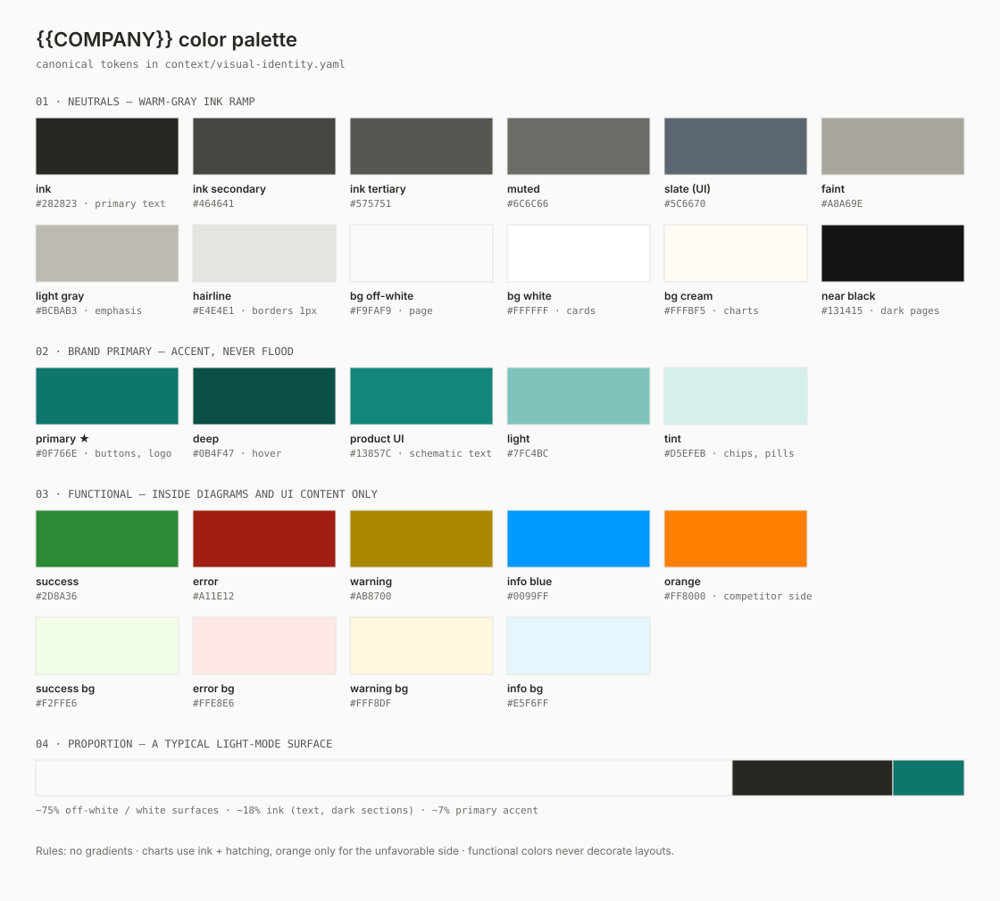
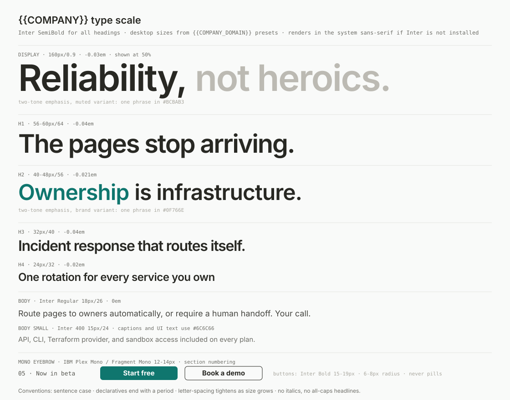
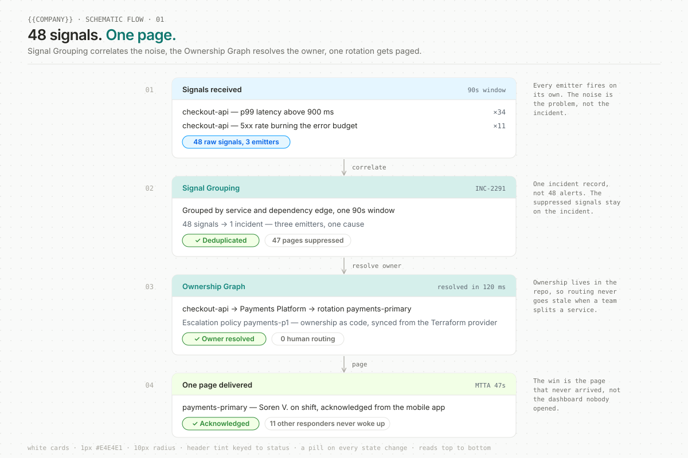
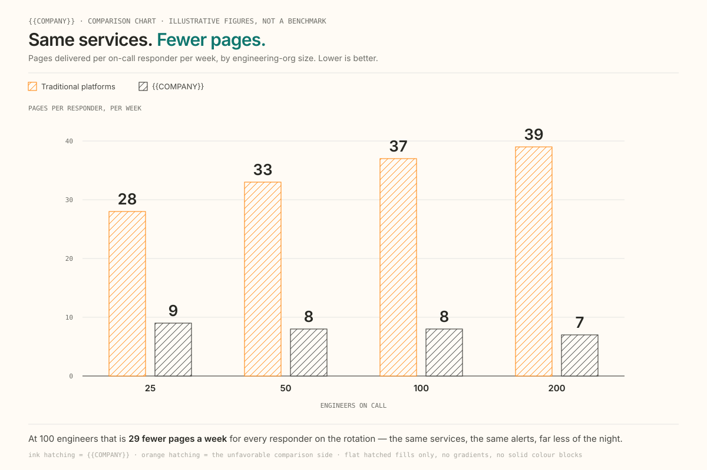

# Visual Identity -- Team SOP

**Version:** 1.0
**Last updated:** with the v1.0 baseline (see Section 9)
**Owner:** Marketing / Brand -- curated by {{DESIGN_LEAD_FIRST}} (Website & Design)
**Applies to:** Anyone (human or agent) producing visual assets: slides, social graphics, diagrams, one-pagers, landing pages, email, event creative
**Machine-readable twin:** `context/visual-identity.yaml` (canonical tokens -- agents load that file; this SOP is the human walkthrough)
**Source:** the brand pack (`context/brand-pack/`) and the shipped site tokens; tokens are canonical in `context/visual-identity.yaml`, not in memory or mocks.

---

## What This Is

This SOP documents how {{COMPANY}} represents itself **visually** -- typefaces, type scale, color, layout devices, and the image styles we publish. It exists so that anything we produce off-site (a deck, a LinkedIn graphic, a PDF) looks like it came from the same company as {{COMPANY_DOMAIN}}.

It is **not** a voice guide. What we say and how we phrase it lives in `sops/brand-review-sop.md` and `context/marketing-project-context.yaml`. Run both checks before shipping: voice via `/brand-review`, visuals via the checklist in Section 7.

**Status note:** v1.0 is derived from the brand pack and the shipped site tokens, not from a ratified design-team source file. Section 8 lists everything {{DESIGN_LEAD_FIRST}} should confirm, correct, or extend. Treat this as a accurate-but-unratified baseline.

---

## Quick Reference Card

| Element | Rule |
|---|---|
| Headline font | **Inter SemiBold (600)** -- always, every level |
| Body font | Inter Regular; the system sans-serif where Inter can't be embedded |
| Label/code font | IBM Plex Mono or Fragment Mono, 400 |
| Headline style | Sentence case; declaratives end with a period |
| Ink (text) | `#282823`, secondary `#464641`, muted `#6C6C66` |
| Brand primary | `#0F766E` -- accent only, never a flood |
| Backgrounds | `#F9FAF9` page / `#FFFFFF` cards / `#282823` dark sections |
| Borders | 1px `#E4E4E1`, always hairline |
| Buttons | Filled `#0F766E`, white Inter Bold label, 6-8px radius, never pill |
| Images | Schematics, line art, halftone B&W portraits -- no stock photos, no gradients, no 3D |

---

## Section 1: Logo

The mark is {{LOGO_MARK_DESCRIPTION}}. The wordmark is "{{COMPANY}}" in Inter. Standard lockup: mark left of wordmark.

**Files in this repo** (`assets/visual-identity/`):

| File | What it is | Use for |
|---|---|---|
| `wordmark.svg` | The ring-orbit mark + wordmark lockup on off-white, 640x160 | The canonical lockup; re-export per channel from this file |
| `favicon.svg` | The ring-orbit mark in white on a `#0F766E` rounded square, 32x32 | App-icon / favicon reference |

**Color rules**

- On light backgrounds: black/ink `#282823`
- On dark or primary backgrounds: white
- Never: recolored marks, drop shadows, rotation, outlines, photographic backgrounds, or stretching

**Gap:** the kit ships only these two vector files -- no stacked lockup, no dark-background lockup, no EPS masters. See Section 8.

---

## Section 2: Typography

### Typefaces

| Face | Weights we use | Source | Role |
|---|---|---|---|
| **Inter** | 400 Regular, 500 Medium, **600 SemiBold**, 700 Bold (900 Heavy exists, unused) | Rasmus Andersson — open source, SIL OFL (self-hosted on {{COMPANY_DOMAIN}}; also on Google Fonts) | Headlines (600), web body (400), buttons/labels (700), UI text inside schematics and mockups (400-500) |
| **IBM Plex Mono** | 400 | Google Fonts | Terminal mockups, code, data labels |
| **Fragment Mono** | 400 | Google Fonts | Eyebrow labels, section numbering ("01", "05 · Now in beta") |

Italics exist but are effectively unused -- avoid them. Never substitute a font not on this list.

**Fallback stacks:**

- Headings and body: `"Inter", -apple-system, sans-serif`
- Mono: `"IBM Plex Mono", "Fragment Mono", ui-monospace, monospace`
- No-custom-fonts environments (Google Docs, most email clients): the system sans-serif for everything, system monospace for labels

### Scale (desktop; reduce ~30-40% for mobile)

| Level | Font | Size / line height | Letter-spacing |
|---|---|---|---|
| Display hero | Inter SemiBold | 160px / 0.9em | -0.03em |
| H1 | Inter SemiBold | 56-60px / 64px | -0.04em |
| H2 | Inter SemiBold | 40-48px / 48-56px | -0.021em |
| H3 | Inter SemiBold | 32px / 40px | -0.04em |
| H4 | Inter SemiBold | 24px / 32px | -0.02em |
| Card title | Inter SemiBold | 19px / 24px | -0.02em |
| Body lead | Inter Regular | 24px / 32px | 0 |
| Body | Inter Regular | 18px / 26px | 0 |
| Body UI / small | Inter 400 | 17px / 24px, 15px / 24px | 0 |
| Button label | Inter Bold | 15-19px / 24px | 0 |
| Mono eyebrow | Plex/Fragment Mono | 12-14px | 0 |

Pattern: letter-spacing tightens as size grows; line-height is tightest at display size.

### Headline conventions

- **Sentence case.** Never title case, never all-caps (tiny mono labels excepted).
- **Declarative headlines end with a period.** "The pages stop arriving." / "Incident response that routes itself."
- **Two-tone emphasis** (signature device): one phrase inside the headline takes a second color, the rest stays ink. Two sanctioned variants:
  - *Muted:* phrase in light gray `#BCBAB3` ("Reliability, **not heroics.**")
  - *Brand:* phrase in primary `#0F766E` ("**Ownership** is infrastructure.")
  - Maximum one colored phrase per headline. Never both variants together.

---

## Section 3: Color

Full swatch sheet: `assets/visual-identity/palette.svg` (embedded above). Canonical hex values live in `context/visual-identity.yaml` -- if this table and the YAML ever disagree, the YAML wins and this doc needs a version bump.

**The three families:**

1. **Warm-gray ink neutrals** carry ~93% of every surface: text `#282823` → `#464641` → `#6C6C66`, hairlines `#E4E4E1`, backgrounds `#F9FAF9` / `#FFFFFF` / cream `#FFFBF5`, dark surfaces `#282823` / `#131415`. These are *warm* grays -- do not substitute pure black, `#333`, or cool grays.
2. **Brand primary** `#0F766E` (deep `#0B4F47`, light `#7FC4BC`, tint `#D5EFEB`) is an accent: one filled button, one emphasized phrase, small icons. If a layout reads "primary page," it's wrong.
3. **Functional status colors** (success `#2D8A36`, error `#A11E12`, warning `#AB8700`, info `#0099FF`, each with a pale background tint) appear **only inside diagram and UI content** -- status pills, banners. They never decorate layouts. Orange `#FF8000` is reserved for the unfavorable/competitor side of comparison charts.

**Hard rules:** no gradients, anywhere, ever. Flat fills only. Dark sections are `#282823` with white headlines and `#BCBAB3` supporting text.

---

## Section 4: Layout & Graphic Devices

These devices are what make a layout read as "{{COMPANY}}" even before the logo appears:

- **Blueprint grid** -- content sits in a visible column grid; 1px `#E4E4E1` vertical hairlines run full section height. The page looks drafted, like an engineering drawing.
- **Diagonal hatching** -- 45° thin-line ink hatching fills empty grid cells and chart bars. Reads as technical-drawing shading, never a solid color block.
- **Dot grid** -- fine stipple texture behind schematic images (light mode) and event-page heroes (dark mode), low contrast.
- **Numbered sections** -- mono-font index labels on features and steps: "01", "02", "05 · Now in beta".
- **Connector arrows** -- thin vertical ↓ arrows between stacked cards; flows always read top-to-bottom.
- **Cards** -- white, 1px `#E4E4E1` border, 8-12px radius, shadow absent or barely visible. Product mockups get macOS window chrome (traffic lights, title bar).
- **Status pills** -- fully rounded, tinted background + 1px same-hue border, optional ✓/✕ glyph.
- **Whitespace** -- generous. Sections breathe. Do not fill gaps with decoration.

---

## Section 5: Imagery

{{COMPANY}} publishes no office photography, no laptop-and-coffee stock, no 3D renders. Every image is one of five styles. The shared aesthetic: **engineering documentation, warmly executed.**

### 5.1 Schematic flow diagrams (the flagship style)

Simplified product-UI cards stacked vertically, linked by thin down-arrows, narrating *trigger → system action → resolved outcome*.

Construction rules: white cards, 1px `#E4E4E1` borders, ~10px radius, flat; pastel header tints keyed to status (light green = success, light red = failure, light blue = neutral); Inter text with primary `#13857C` for feature names; status pills on every state change; plausible fictional data, never lorem ipsum; export as SVG.

More examples in `assets/visual-identity/`: `example-schematic-escalation-policy.svg` (escalation levels, timers, acknowledge and never-reached states), `example-schematic-postmortem-export.svg` (Learning Loops timeline → postmortem export to `~~knowledge base`), `example-schematic-rotation-form.svg` (a Rotation Studio schedule form with inline validation pills).

### 5.2 Line-art technical diagrams

Patent-drawing-style figures for abstract concepts: 1px ink strokes, dotted construction lines, small filled node dots, isometric layers, orbital ellipses. Strictly monochrome -- no fills except node dots. Geometry over metaphor.

(On-site reference: the three "Ownership is infrastructure." feature figures on the homepage.)

### 5.3 Halftone portraits

All people -- customers, speakers, founders -- get a black-and-white halftone/dither treatment, background removed or white. Small avatars use circular crops of the same treatment. Never publish full-color headshots inline with marketing content.

*(Halftone portrait example: generate one with `/gtm-fleet:brand-designer dither-pack <portrait>` — the shipped kit carries no photographic assets.)*

### 5.4 Terminal mockups

macOS terminal windows running real `{{company_slug}}` CLI commands: mono font, `❯` prompt, muted output, green highlight row for success. (No hero composite ships with the kit; the profile supplies one.)

### 5.5 Comparison charts

Editorial bar charts on cream `#FFFBF5`: hatched bar fills, large Inter SemiBold numerals, orange segments only on the competitor/unfavorable side, minimal square-swatch legend.

### Prohibited

Stock photography or lifestyle imagery · 3D renders, glassmorphism, blurred-gradient "SaaS hero" backgrounds · gradients of any kind · full-color photographic headshots · heavy drop shadows · mascots or cartoon characters · emoji as design elements.

---

## Section 6: Channel Recipes

**Slides / decks.** Off-white `#F9FAF9` slides, ink text, Inter SemiBold titles (sentence case, period), max one primary-emphasis phrase per title, hairline rules to divide regions, mono numbered labels for agenda/steps. Close on a dark `#282823` slide: white headline, primary button styling for the CTA.

**Social graphics.** Two sanctioned looks: (1) *light* -- off-white field, blueprint hairlines, big two-tone headline, optional schematic card; (2) *dark/event* -- `#131415`/`#282823` field, dot-grid texture, white headline, mono date eyebrow. Logo small, single placement.

**One-pagers / PDFs.** White page, blueprint column grid, mono section numbers, one schematic or line-art figure per section, status pills for checklists. Footer: logo lockup + primary accent rule.

**Email.** System-safe only: Inter (Arial fallback), ink on white, one primary button (`#0F766E`, white label, 6-8px radius), hairline dividers. No textures -- email clients butcher them.

**Agent-generated diagrams** (Mermaid/SVG/HTML). Ink strokes on white, `#E4E4E1` box borders, primary `#0F766E` for the focal node only, mono labels, top-to-bottom flow, status colors per Section 3.

---

## Section 7: Pre-Flight Checklist

Run before shipping any visual asset (agents: this mirrors `compliance_checklist` in the YAML):

- [ ] Headlines in Inter SemiBold (or the system sans-serif fallback), sentence case, period on declaratives
- [ ] At most one emphasis color in any headline (gray *or* primary variant)
- [ ] Primary is `#0F766E` and used as accent, not flood
- [ ] Neutrals from the warm-gray ink ramp -- no pure `#000`, no cool grays
- [ ] Borders/dividers are 1px `#E4E4E1`
- [ ] No gradients, stock photos, 3D, or heavy shadows
- [ ] People appear only as halftone B&W treatments
- [ ] Diagrams flow top-to-bottom with thin arrows and status pills
- [ ] Mono font on eyebrows, numbering, code, data labels
- [ ] Dark surfaces use `#282823`/`#131415` with white + `#BCBAB3` text
- [ ] Voice check passed separately via `/brand-review`

---

## Section 8: Curation Queue ({{DESIGN_LEAD_FIRST}})

Everything below is either inferred, inconsistent at the source, or missing. This is the springboard list -- ruling on these turns v1.0 into a ratified v2.0:

1. **Vector logo kit.** Only `wordmark.svg` and `favicon.svg` ship here. Add the rest of the master lockups (mark alone, horizontal, stacked; light/dark; EPS for print) to `assets/visual-identity/`.
2. **Inter distribution.** Inter is SIL OFL, so there is no licence to clear — but document where teammates download the static files and which weights to install, so off-web assets stop silently falling back to the system sans-serif.
3. **Mobile type scale.** The "reduce 30-40%" guidance is inferred from responsive behavior, not specified. Define actual mobile breakpoint values.
4. **Accessibility.** Contrast ratios were not audited. `#6C6C66` on `#F9FAF9` and `#BCBAB3` emphasis text likely fail WCAG AA at small sizes -- define minimum sizes/weights for muted colors.
5. **Legacy presets.** The site CSS still carries display presets (Bold/Book/Regular) from the retired *Sidereal* identity -- apparent leftovers from before the current system. Confirm dead, then have the web team remove.
6. **Photography policy edges.** Halftone-only is the observed rule for marketing surfaces. Does it extend to webinar thumbnails, YouTube, paid social, press kits?
7. **Motion/video.** Undocumented -- no motion language exists yet. If video is coming (e.g., Reliability Roundtable recordings), define title cards, lower-thirds, and end cards from this system.
8. **Dark-mode card specs.** Event-page form fields/cards were observed but not pixel-measured (exact dark panel fills, border alphas). Capture from Framer source when convenient.

Process: {{DESIGN_LEAD_FIRST}} edits this SOP and `context/visual-identity.yaml` together, bumps the version on both, and notes the change below.

---

## Section 9: Maintenance

- **Source of truth chain:** {{COMPANY_DOMAIN}} (live) → `context/visual-identity.yaml` (tokens, agent-consumed) → this SOP (human guidance). Changes flow in that direction; the YAML and this doc must move together.
- **Version protocol:** same as `docs/gtm-scorecard-definitions.md` -- any definition change requires a version bump and a changelog line here.
- **Re-audit cadence:** re-run a live-site audit after any significant website redesign, or quarterly, whichever comes first.

**Changelog**

| Version | Date | Change |
|---|---|---|
| 1.0 | — | Initial baseline derived from the brand pack and the site tokens |
